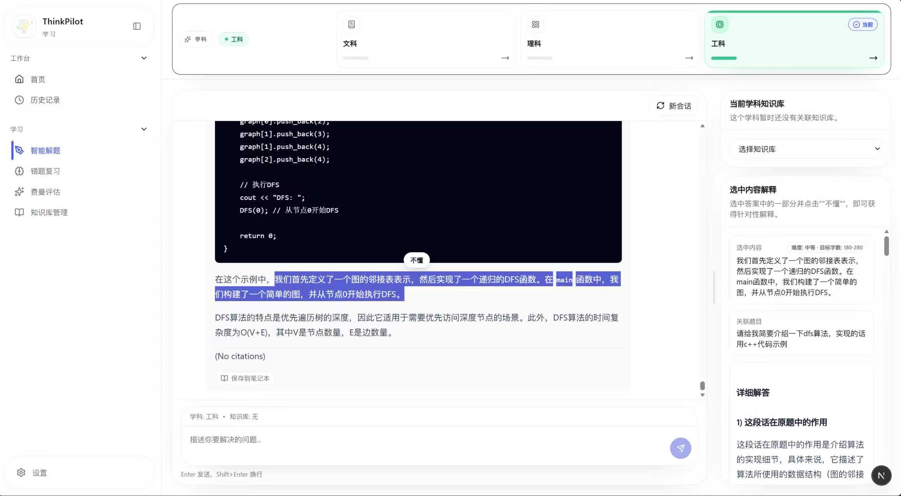
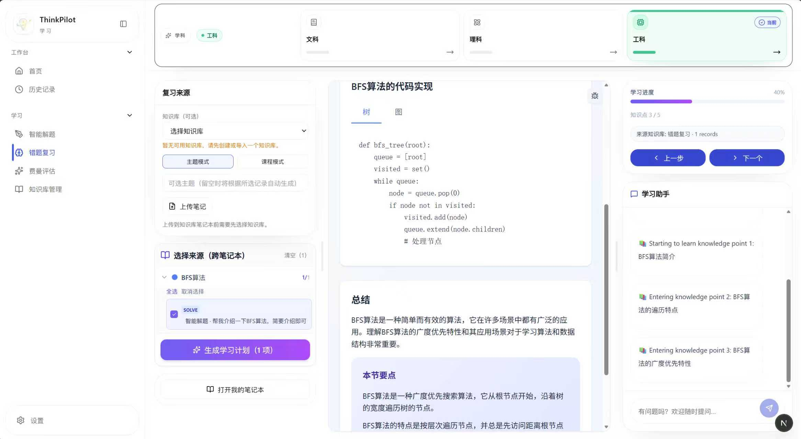
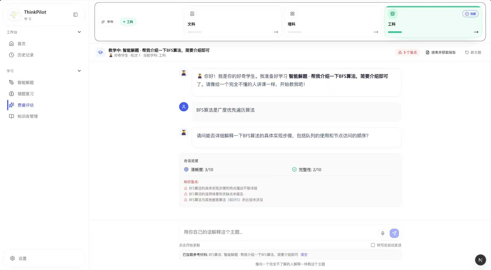

<p align="center">
  
</p>

<h1 align="center">ThinkPilot</h1>

<p align="center">
  覆盖解题、错题复习与费曼检验的多智能体全流程学习平台
</p>

ThinkPilot 不是只给答案的问答工具，而是把多个智能体串联成可持续的学习闭环。用户从一道不会的问题开始，经过智能解题、错题沉淀与针对性复习，最后通过费曼讲解检验自己是否真正掌握。

> ThinkPilot 是基于 [HKUDS/DeepTutor v0.2.0](https://github.com/HKUDS/DeepTutor/tree/v0.2.0) 修改开发的衍生项目，并依照 GNU Affero General Public License v3.0 发布。

## 完整学习闭环

`不会的问题 → 多智能体协作解题 → 加入错题本 → Agent 制定复习计划 → 费曼讲解 → 掌握度评估`

1. **智能解题**：多个智能体分工完成问题分析、资料检索、推理求解与结果验证，输出可理解、可追踪的分步答案。
2. **错题复习**：将典型错题或仍未掌握的问题沉淀到错题本；Agent 分析薄弱知识点与错误原因，制定针对性复习计划并陪伴复习。
3. **费曼评估**：用户作为老师向扮演学生的 Agent 讲解知识；Agent 通过提问和追问检查理解，并从准确性、完整性与表达清晰度评估掌握程度，指出仍需补强的部分。

### 页面展示

#### 智能解题



#### 错题复习



#### 费曼评估



## 核心能力

- **多智能体协作**：分析、检索、求解、验证和教学评估等角色围绕同一学习目标协同工作。
- **学科路由**：支持文科、理科和工科上下文，并为不同学科加载独立配置。
- **RAG 知识增强**：导入学习材料后完成解析、分块、索引与检索，让讲解和复习建立在个人知识库之上。
- **学习资产沉淀**：统一管理错题本、笔记、知识库与学习记录，让一次提问转化为可持续复习的材料。
- **流式全栈体验**：FastAPI 提供 API 与流式交互，Next.js 提供响应式学习界面。
- **多提供商配置**：支持通过环境变量配置 LLM、Embedding、搜索与 TTS 服务。

## 技术栈

- **智能体与模型**：Python 3.10+、LangGraph、多智能体工作流；支持 OpenAI、Anthropic、Google GenAI、DashScope 等模型接口
- **后端与数据**：FastAPI、Uvicorn、WebSocket、Pydantic、SQLAlchemy、SQLite / aiosqlite
- **RAG 与文档知识库**：LightRAG、LlamaIndex、RAG-Anything、Docling；支持稠密、混合与图检索，以及固定、语义和编号分块
- **前端**：Next.js 16、React 19、TypeScript、Tailwind CSS、i18next
- **工程化**：Pytest、Ruff、Black、ESLint、Prettier、Docker Compose、GitHub Actions

## 快速开始

### 1. 获取代码并准备配置

```bash
git clone https://github.com/Leon-Wang919/ThinkPilot.git
cd ThinkPilot
cp .env.example .env
```

编辑 `.env`，至少配置可用的 LLM。知识库功能还需要 Embedding 配置。不要把真实密钥提交到 Git。

### 2. 安装依赖

```bash
python -m venv .venv
source .venv/bin/activate  # Windows: .venv\Scripts\activate
pip install -r requirements/base.txt -r requirements/dev.txt

cd web
npm ci
cd ..
```

OCR、RAG 和本地模型相关能力为可选组件，按需安装 `requirements/` 下对应的依赖文件。

### 3. 启动

```bash
python scripts/dev.py healthcheck
python scripts/dev.py fullstack
```

默认访问地址：

- Web：<http://localhost:3782>
- API：<http://localhost:8001>
- API 文档：<http://localhost:8001/docs>

也可以分别执行 `python scripts/dev.py backend` 和 `python scripts/dev.py frontend`。

## Docker

```bash
cp .env.example .env
docker compose up --build
```

开发模式：

```bash
docker compose -f docker-compose.yml -f docker-compose.dev.yml up --build
```

## 项目结构

```text
ThinkPilot/
├── config/          # 应用、智能体与学科配置
├── data/            # 运行数据说明；实际用户数据默认忽略
├── docs/            # 补充文档
├── requirements/    # 基础与可选 Python 依赖
├── scripts/         # 开发、检查、迁移和打包入口
├── src/             # FastAPI、智能体、图编排与服务层
├── tests/           # 后端测试
└── web/             # Next.js 前端
```

## 开发与验证

```bash
python scripts/dev.py lint
python scripts/dev.py test
python scripts/dev.py verify
```

前端也可在 `web/` 目录单独运行：

```bash
npm run lint
npm run i18n:check
npm run build
```

提交代码前建议安装钩子：

```bash
pre-commit install
pre-commit run --all-files
```

## 配置与数据

- 主配置：[`config/main.yaml`](config/main.yaml)
- 智能体配置：[`config/agents.yaml`](config/agents.yaml)
- 环境变量模板：[`.env.example`](.env.example) / [中文模板](.env.example_CN)
- 数据目录策略：[`data/README.md`](data/README.md)
- 离线分享包：[打包说明](docs/sharing.md)

`data/user/`、本地数据库、日志、上传内容、前端构建产物和环境文件均已在忽略规则中排除。

## 参与贡献

欢迎提交 Issue 和 Pull Request。开始前请阅读 [CONTRIBUTING.md](CONTRIBUTING.md)，安全问题请按 [SECURITY.md](SECURITY.md) 中的方式报告。

## 上游来源与修改说明

ThinkPilot 基于 [HKUDS/DeepTutor v0.2.0](https://github.com/HKUDS/DeepTutor/tree/v0.2.0) 修改开发。原始项目及其贡献者保留原始代码、文档与素材的版权。

本项目对上游进行了品牌、前后端功能、智能体流程、学科路由、测试、文档与工程配置等修改。主要修改及日期记录在 [MODIFICATIONS.md](MODIFICATIONS.md)，上游归属说明见 [NOTICE](NOTICE)。

ThinkPilot 与香港大学 Data Intelligence Lab、HKUDS 没有隶属或官方背书关系。

## 许可证

本项目作为一个整体依照 [GNU Affero General Public License v3.0](LICENSE)（SPDX：`AGPL-3.0-only`）发布。

如果修改后的 ThinkPilot 通过网络向用户提供服务，必须向这些用户明确提供正在运行版本的对应源代码。应用侧边栏中的 “Source Code / 源代码” 链接用于提供源代码入口。

